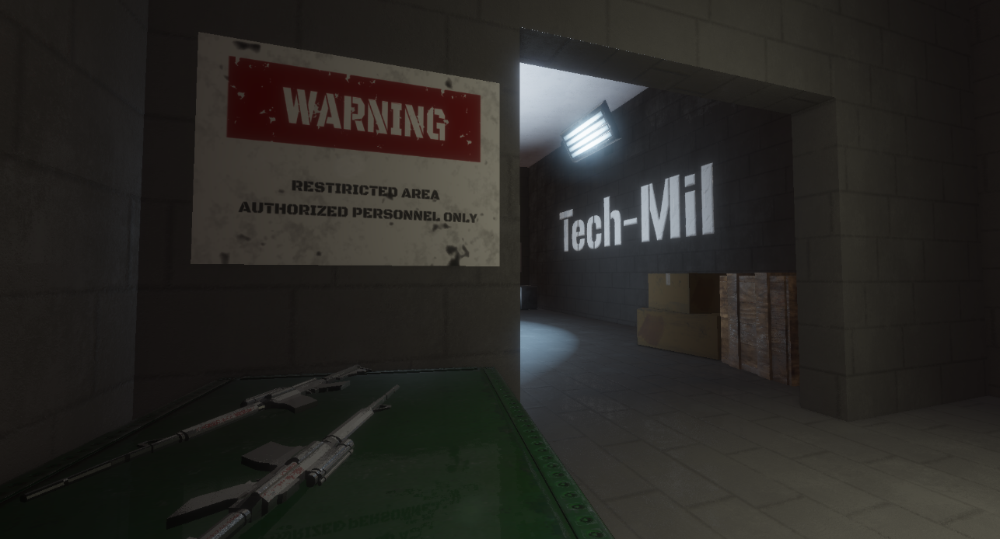


Together with a friend, take on the role of an agent and a hacker who must stop a military company from launching a dangerous combat robot.


## Overview

**Silence** is a cooperative stealth game created over the span of 4 months by a team of 6 students from the **Łódź University of Technology**.

It was made for the ZTGK 2023 contest and got to **TOP 3** in the **Game Development** category.

It was also awarded by the **11 bit studios** company.

<!--  -->



The gameplay is focused on cooperation between the two players.
As agent, you have to sneak around the map, avoiding the guards and activating the switches.
As hacker, you have to help the agent by distracting the guards and hacking the security cameras.
Because of the assymetry between the abilities of the two players, it's crucial that they communicate and cooperate with each other.

You can download the game on [itch.io](https://cladur.itch.io/silence) or check the source code on [GitHub](https://github.com/cladur/silence).

## Art

### Assets

All the assets - models, textures and animations were created single-handedly by [Agata Granosik](https://www.artstation.com/agatagranosik).
They were made using Blender and Substance Painter, and then later imported into the game using our own custom tools.
The game's artstyle was designed to be realistic, yet a bit stylized.
Textures were created using the PBR workflow.


  
  
  
  
  
  
  
  
  
  
  
  
  
  
  
  
  
  
  
  
  
  
  
  
  


### Music and Sounds

To achieve spatial sounds and music that can change with the flow of gameplay we used FMOD Studio API and integrated it with our engine. All the sounds and music from the game were created by [Hubert Łabuda (aka Maeror)](https://linktr.ee/Maeror) using FL Studio, various plug-ins and real life recordings. An FMOD Studio project was then created with all of the sounds and music that was split into multiple banks that are loaded at the start of the game.

## Engine

### Renderer

#### PBR Renderer with Deferred Shading

The renderer is based on the Physically Based Rendering model.
It uses a deferred shading technique to render the scene in multiple passes.
Because of that, our engine is capable of rendering hundreds of lights without any performance issues.



<!-- Due to the lack of light baking, we "emulated" light bouncing through the scene by placing multiple light sources in the place of a single actual light source.
On the picture above, you can see each light having 3 different "shapes".
There's a spot light, which is the main source of light, a large point light, which is used to simulate light bouncing off the environment, and a small point light placed near the light source, which is used illuminate the lamp and give it the bloom effect. -->

#### Volumetric Lights

The renderer supports volumetric lights, which are used to create a more climatic atmosphere.
They are computed based on the light's shadow map using raymarching.



#### Physically Based Bloom



#### SSAO



#### SSR





#### Decals



#### Particles



### ECS

We decided to use ECS paradigm for this project, becuase of it's flexibility and performance.
Because of that, we were able to create a very modular and extensible engine, where adding new features was simply a matter of creating new components and systems.
Thanks to the use of ECS, our game's CPU usage was very low, leading to the frametime being only bottlenecked by the player's GPU.

### Physics



We created our own physics engine from scratch. It supports AABB, OBB, sphere and capsule colliders. Collision checks with static objects are done by traversing a BSP tree, while dynamic objects are checked with every other object (we are doing early rejection optimizations).

Our physics engine also supports `Raycast`s, which are used everywhere inside our game logic, as well as `SphereOverlap`s and `BoxOverlap`s.

### Animations



Our engine supports skeletal animation with up to 512 bones per animation. We also implemented blending between the animations and functionality to attach any object to selected bone -- for ex. a gun to the enemy or a knife to the agent.

## Tools

### Asset Baker



We created a tool that automatically grabs all the glTF files, their textures and animations, and bakes them.

Models and animations are converted to a format that can be instantly loaded by our game, without any extra processing required. We also compute the bounding spheres of the meshes, so that later they can be used for the frustum culling.
The data is then compresses using LZ4 and saved to a binary file.

Textures are compressed into the KTX format, with their mipmaps being pregenerated. At runtime they are quickly transcoded in parallel into BC3, BC5 or BC7 formats, depending on the texture type and hardware support.

Skybox textures are processed as well, computing the irradiance and prefiltered specular maps, which are required for PBR rendering.

Thanks to that, not only is the asset size reduced by more than 50%, but also the loading of the game is much faster.

### Editor

We created a custom editor for our game, which we used to create the levels and set the relations between the entities.
It's interface is created using the Dear ImGui library.

#### Basic Features



Our editor allows the user to create and delete entities and manage their parent-child relationships.
You can freely add and remove components from entities, such as models, colliders, lights and etc.

Some of the features include:

- Mouse Picker -- selecting entities by clicking on them (done by rendering entities IDs to a texture and reading the pixel under the cursor),
- Gizmos -- with the use of ImGuizmo library,
- Content Browser -- allows the user to browse through the assets and drag them into the scene,
- Inspector -- lists components that the entity has,
- Scene Browser -- lists entities in the scene and showcases their parent-child relationships.

#### Visualization Layers



Various visualization layers can be enabled in the editor, displaying useful information about:

- Colliders (AABB, OBB, Sphere, Capsule),
- Lights,
- Cameras,
- Checkpoints,
- Dialogue Triggers,
- Decals.

#### Prefabs

We created a prefab system, which allows the user to create prefabs, which are precreated entities that can be quickly copy-pasted through-out the scene.
We used them to create complex complex game objects, which were composed of multiple entities, such as the enemies or cameras.



## Our Experience

### What went well

Through out the development of this project we learned a lot about the game development and the process of creating a game from scratch.

There were many aspects about the game which increased the size of our scope:
- **True** 3D game, instead of something like 2.5D,
- Stealth genre, which required solid AI and level design,
- Coop, which makes the game harder to playtest, balance and design. Also puts more pressure on the rendering system.

Despite the huge scope and limited resources, we managed to ship a demo that is both fun to play and has a good amount of content.

Making the editor ourselves was a great decision, as it allowed us to quickly iterate on the game's design and create levels.
The fact, that the editor and the game were using the same codebase, allowed us to seamlessly add new features.

### What went wrong

We initially set out to use Vulkan as our rendering API, but we quickly realized that it would be too much work for the timeframe of this project.
This set us back a week or two, as we had to abandon the already written Vulkan codebase.

Personally however, getting to know Vulkan was a great learning experience and we did manage to implement some modern rendering techinques with it, such as the bindless rendering.
So, while using Vulkan was bad for the project, it was good for our education.

### What we learned

- Try to get the core gameplay loop working as soon as possible, so that you can iterate on it. We spent too much time on the rendering and editor, which left us with little time to polish the gameplay.
- Organize the work, so that everyone can work as much in parallel as possible. In the beginning some of us were blocked by waiting for the others to finish their tasks, which slowed down the development.
- Try to have everyone on the newest version of codebase. In the beginning we were doing feature branches that would diverge over the course of days or weeks, which made merging them a nightmare. After switching to [Trunk Based Development](https://trunkbaseddevelopment.com/), we merged our work much more often, which resulted in all of us being on the same page.

### What we would do differently

If starting over was an option, we would focus more on the editor at the beginning of the project, as opposed to the game's runtime.
As we've come to realize, programming in new features and game logic can only get you so far.
Creating **content** is also a big part of the game development, and having a good toolset for that is critical.

While the editor we've made was a great tool, it was lacking some features that would make it even more useful, such as:
- Dedicated Model component for walls and floors, instead of using a cube prefab made out of 6 plane models. This would allow us to iterate more rapidly on the level design.
- More thought out scene management. Our scenes were just a list of entities, which became a problem when we introduced prefabs. In the end our "prefabs" were more of a glorified copy-and-paste than something you would expect if you've knew Unity's Prefabs. Going forward we would like for a scene to reference a prefab, instead of just copying it.
- C++ Reflection. Every time we added a new field to a component, we had to manually add it to the editor's GUI code. This was a big chore and could easily be automated.

Although our game loads very fast, our work could be even more streamlined if we added the **hot-reload system**, so that we wouldn't have to restart the game every time we made a change in the code.

While we're happy with out asset pipeline, we could improve it further by 

## Team

[Jan Maślak](https://cladur.github.io/) - Leadership, Rendering, Level and Game Design, Asset Baker, Editor

[Maciej Poncyleusz](https://github.com/Merloran) - Physics, Rendering, Animation Programming

**Mateusz Kowalski** - ECS, Editor, Level Design, Game Programming

**Adam Koch** - Game Programming, Tracy Integration, Input Management

[Hubert Łabuda](https://linktr.ee/Maeror) - Music and Sounds, FMOD Integration, UI, AI

[Agata Granosik](https://www.artstation.com/agatagranosik) - Modeling, Texturing, Animations